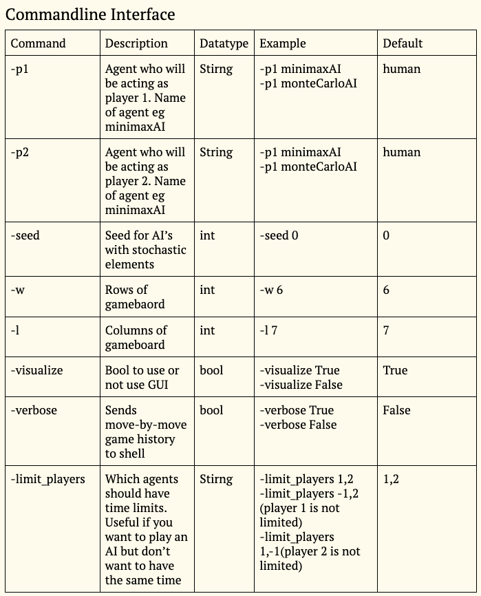
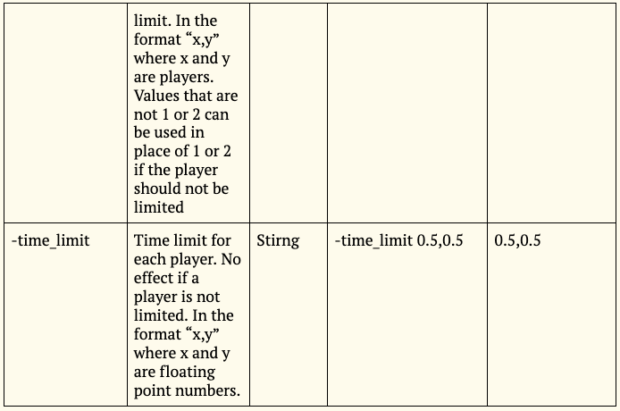

# Connect4_AI

Using minimax algorithm with self-define cost funtion to implment AI player for Connect4 Game, minmax AI is optimzed with alpha-beta pruning.
Three Main AI is built as minimaxAI, alphaBetaAI and monteCarloAI.

Sample Command Line to run:
python main.py -p1 alphaBetaAI -p2 monteCarloAI -limit_players 1,2 -verbose True -seed 0

File Included:
connect4.py, main.py, montecarlo.py, thread.py, players.py
